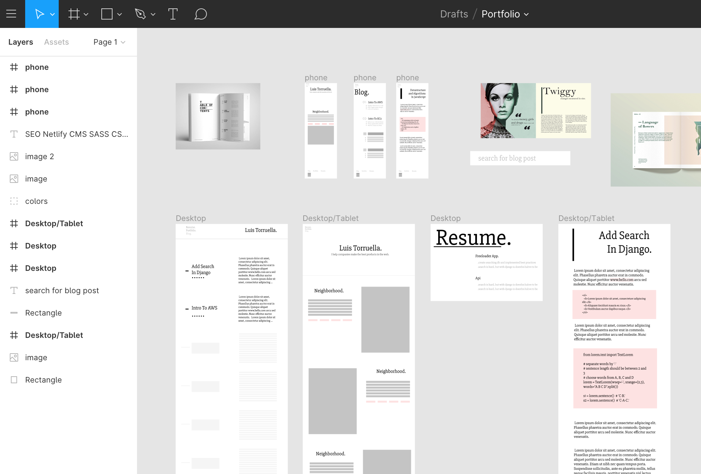

# Portfolio 

## This website was boostrapped with gtasby.js

### Installation 

Run Local Server:

 * `npm install`
 * `npm run develop`

Navigate to `localhost:8000`

### Features
* Portfolio

### Upcoming
* Nightmode
* Blog
* CSS refactor to SASS
* Perfomance
* SEO
* Resume
* Images Perfomance
* Bring Users ;)
* Wakatime Graphs
* Optimize for iPad

## Follow the vision in Figma: 
[Portfolio](https://www.figma.com/file/UnqfhgnDNeTsMvSvTPiTcwkb/Portfolio?node-id=0%3A1)

